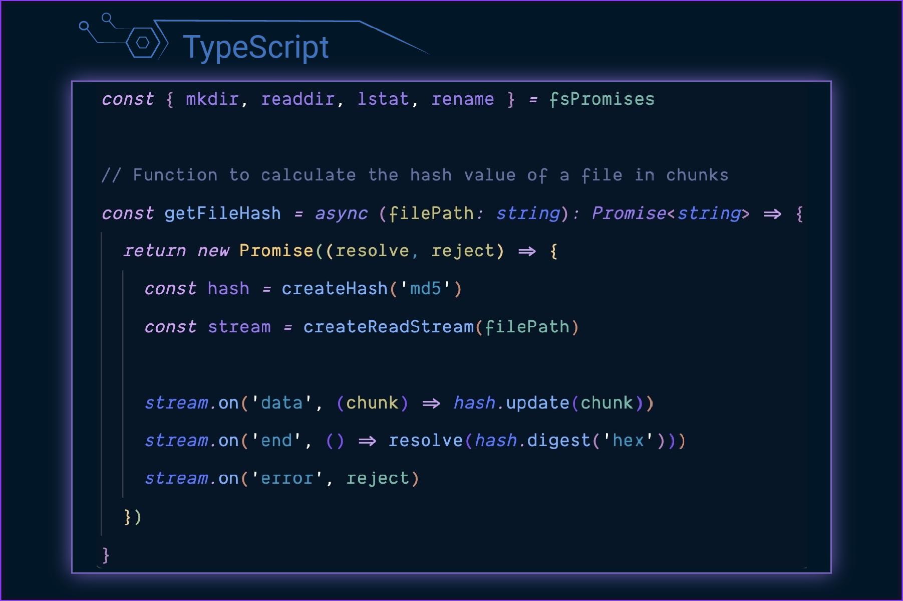
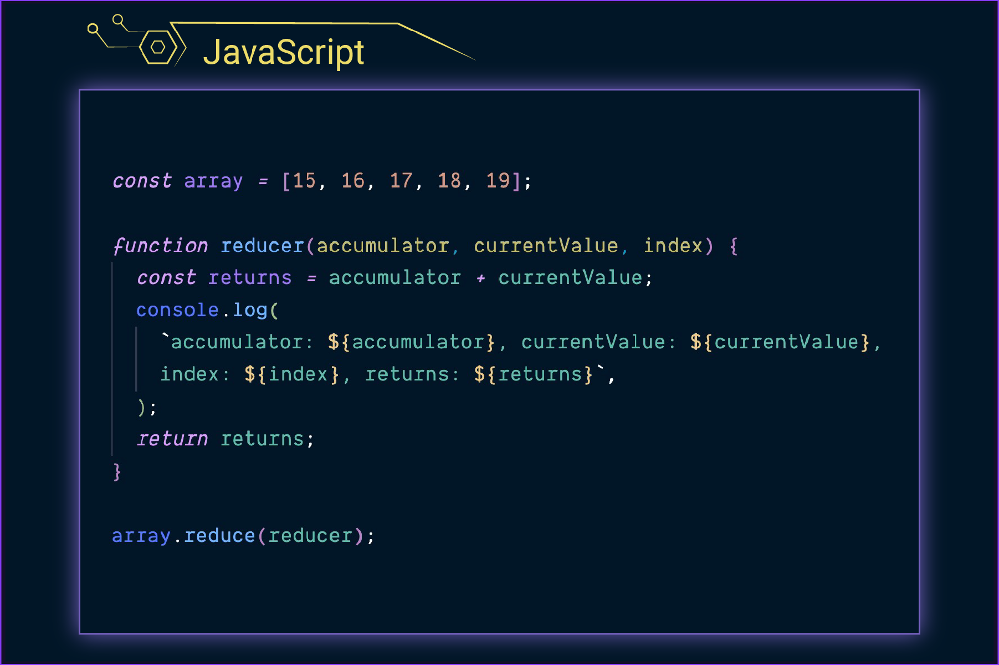
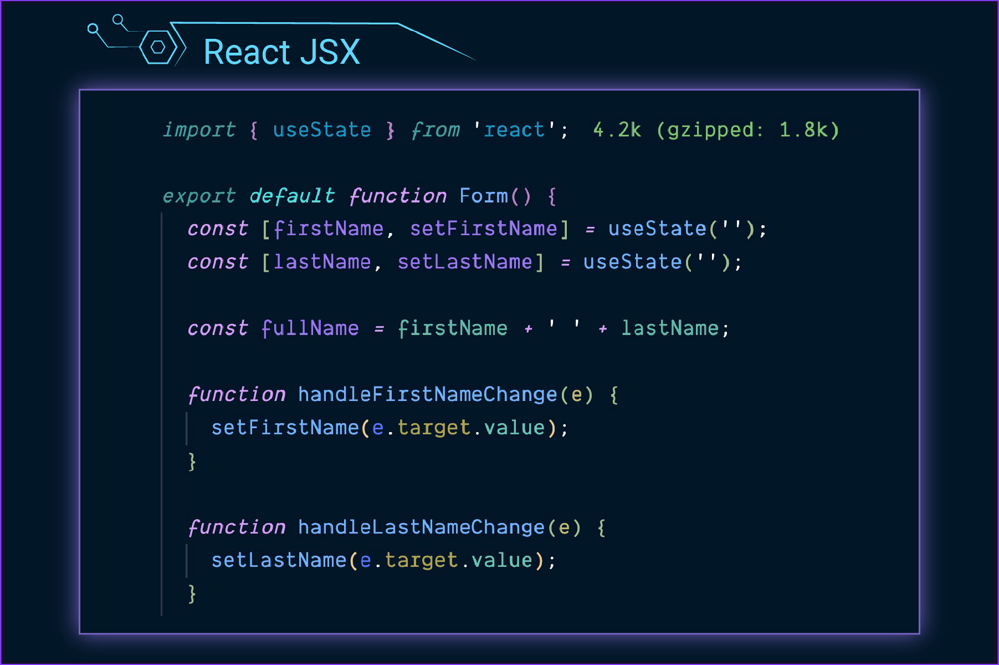
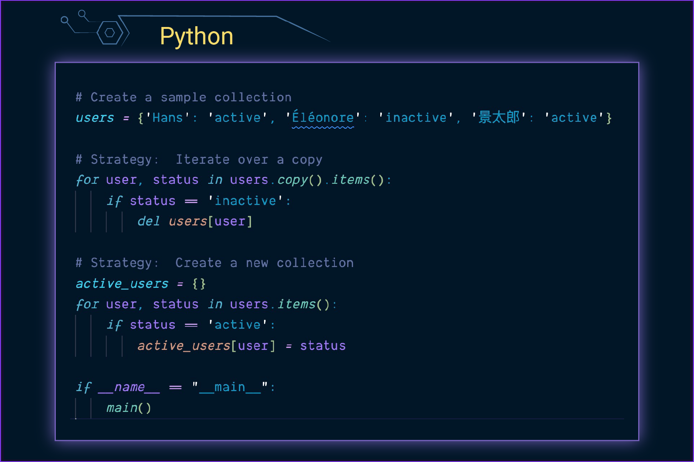
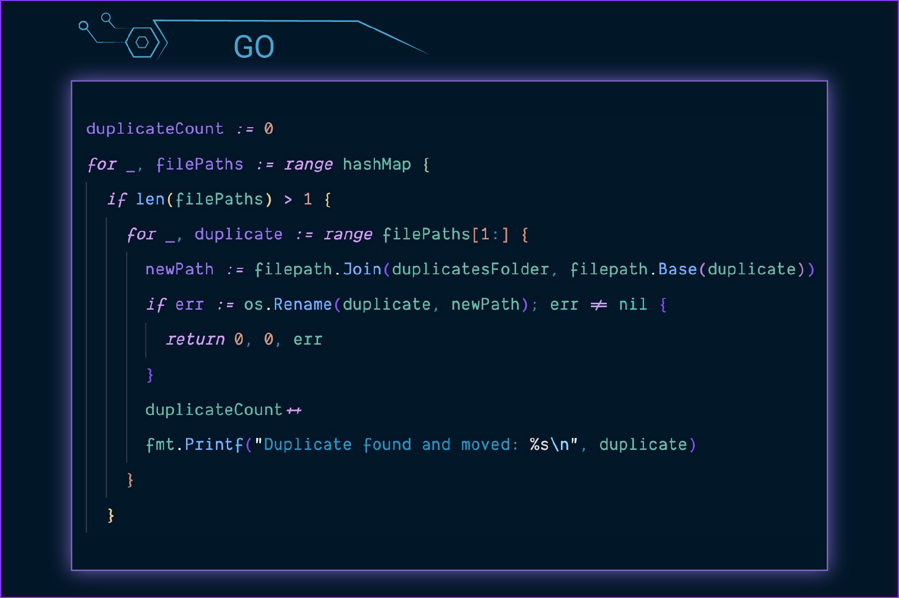
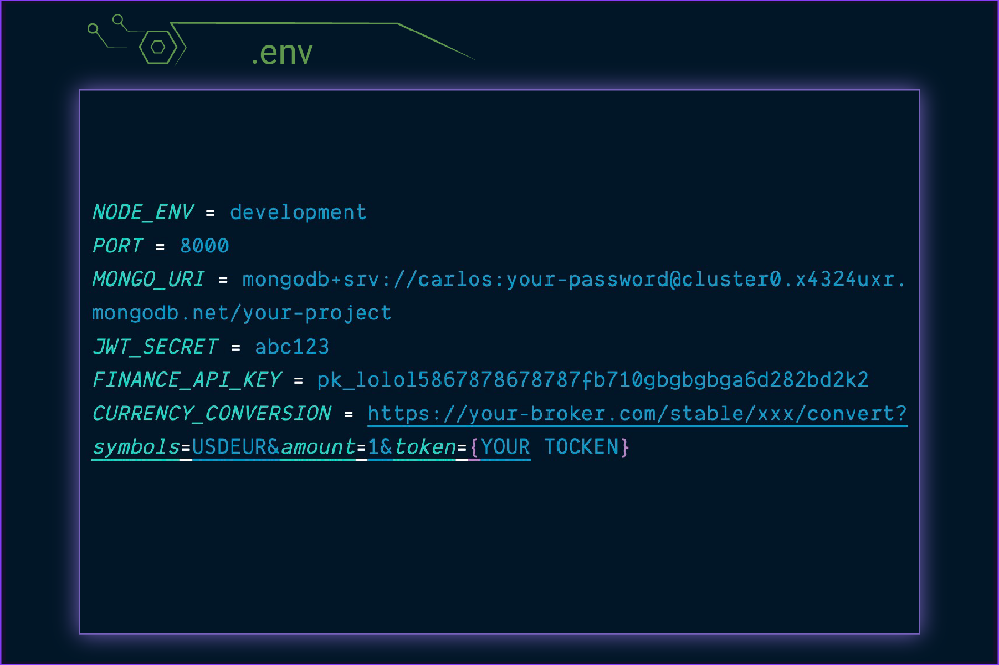
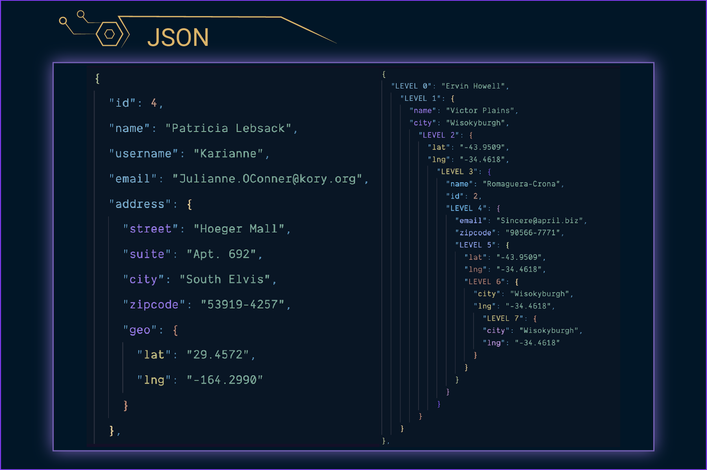
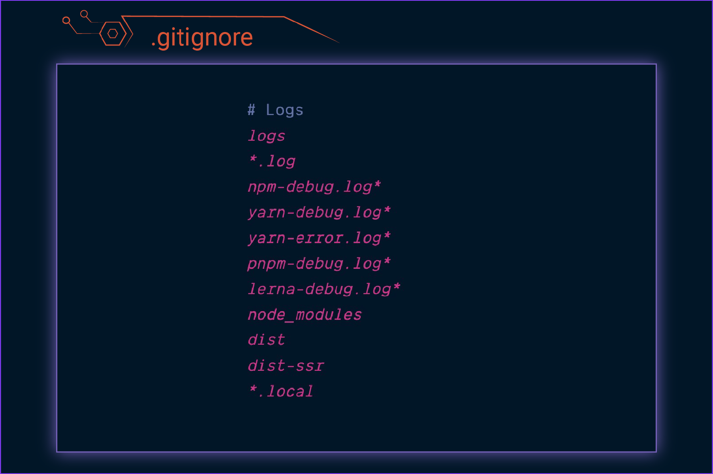

<div align="center">


</div>

**English:**
#### Theme Variants:
- **Cyberpunk 2021** - Ideal for vibrant, dynamic coding experiences
- **Deep Focus** - Tailored for intense, concentrated programming
- **Non-Italic versions** of both Cyberpunk 2021 and Deep Focus are available.

**Deutsch:**
#### Theme Varianten:
- **Cyberpunk 2021** - Perfekt für lebendige, dynamische Codier-Erlebnisse
- **Deep Focus** - Ideal für konzentriertes, intensives Programmieren
- **Nicht-italic-Versionen** von Cyberpunk 2021 und Deep Focus sind verfügbar.




















#### Installation
##### English:
- Open the Extensions sidebar in VS Code:
  - Navigate to View → Extensions.
  - Search for **"Cyberpunk 2021"** or [view it directly on the Marketplace](https://marketplace.visualstudio.com/items?itemName=techwithcarlos.cyberpunk-2021).
  - Click **Install**.
- Select the theme:
  - Go to Code → Preferences → Color Theme and choose "Cyberpunk 2021" or use the settings icon in the sidebar to select "Color Theme".
- Optional: Apply the recommended settings below for the best experience.
- **Usage:** Select the theme and happy coding!
- **Shortcut:**
  - macOS: Cmd + K, Cmd + T
  - Windows/Linux: Ctrl + K, Ctrl + T

##### Deutsch:
- Öffne die Erweiterungen-Seitenleiste in VS Code:
  - Gehe zu Ansicht → Erweiterungen.
  - Suche nach **"Cyberpunk 2021"** oder [ansicht direkt im Marketplace](https://marketplace.visualstudio.com/items?itemName=techwithcarlos.cyberpunk-2021).
  - Klicke auf **„Installieren“**.
- Wähle das Theme aus:
  - Gehe zu Code → Einstellungen → Farbschema und wähle „Cyberpunk 2021“ aus oder benutze das Zahnrad-Symbol in der Seitenleiste, um „Farbschema“ auszuwählen.
- Optional: Wende die empfohlenen Einstellungen unten für das beste Ergebnis an.
- **Benutzung:** Wähle das Theme aus und viel Spaß beim Programmieren!
- **Shortcut:**
  - macOS: Cmd + K, Cmd + T
  - Windows/Linux: Ctrl + K, Ctrl + T

<hr style="height: 1px; background-color: #21FE9F; border: none;" />

#### Recommended Settings:
Optimiert für intensives und fokussiertes Programmieren

#### Recommended Settings:
Optimized for intense and focused programming

```json
{
  "workbench.colorTheme": "Cyberpunk 2021",

  "editor.fontFamily": "Dank Mono, Fira Code, Inconsolata",
  "editor.fontSize": 16,
  "editor.lineHeight": 1.5,

  // Trim trailing whitespace on save
  // Entfernt Leerzeichen am Zeilenende beim Speichern
  "files.trimTrailingWhitespace": true,

  // Do not render whitespace characters
  // Keine Leerzeichen Zeichen anzeigen
  "editor.renderWhitespace": "none",

  // Enable font ligatures
  // Aktiviert Schriftligaturen
  "editor.fontLigatures": true
}

{
  //Cyberpunk 2021 - Ideal for vibrant and dynamic coding experiences
  //Cyberpunk 2021 - Perfekt für lebendige und dynamische Coding Erlebnisse
  "workbench.colorTheme": "Cyberpunk 2021",

  "editor.fontFamily": "Dank Mono, Fira Code, Inconsolata",
  "editor.fontSize": 16,
  "editor.lineHeight": 1.5,

  // Trim trailing whitespace on save
  // Entfernt Leerzeichen am Zeilenende beim Speichern
  "files.trimTrailingWhitespace": true,

  // Do not render whitespace characters
  // Keine Leerzeichen Zeichen anzeigen
  "editor.renderWhitespace": "none",

  // Enable font ligatures
  // Aktiviert Schriftligaturen
  "editor.fontLigatures": true
}
```
<hr style="height: 1px; background-color: #21FE9F; border: none;" />


```json
{
  // Tailored for intense and focused programming
  // Optimiert für intensives und fokussiertes Programmieren
  "workbench.colorTheme": "Cyberpunk 2021 Deep Focus",

  // Set terminal font for better symbol support and readability
  // Setzt Terminal Schriftart für bessere Symbolunterstützung und Lesbarkeit
  "terminal.integrated.fontFamily": "'Hack Nerd Font', 'MesloLGS NF', 'Dank Mono', 'Fira Code'",

  // For more terminal symbol options, visit: https://www.nerdfonts.com/cheat-sheet
  // Weitere Terminal Symbole findest du unter: https://www.nerdfonts.com/cheat-sheet

  // Disables all shadows
  // Deaktiviert alle Schatten
  "widget.shadow": "default",
  "scrollbar.shadow": "default",

  // Turns off line numbers, breadcrumbs, status bar, activity bar, and editor tabs
  // Deaktiviert Zeilennummern, Breadcrumbs, Statusleiste, Aktivitätsleiste und Editor Tabs
  "editor.lineNumbers": "off",
  "breadcrumbs.enabled": false,
  "workbench.statusBar.visible": false,
  "workbench.activityBar.location": "hidden",
  "workbench.editor.showTabs": "none",
}
```
<hr style="height: 1px; background-color: #21FE9F; border: none;" />


**English:**

- No setup required—just install and start coding!
- Actively supports deep focus and enhances your workflow.
- Crafted by developers, for developers.
- Keeps your mind sharp; quickly spot code relationships and differences.
- Specifically optimized for the Big Five languages: JavaScript, TypeScript, Python, Go, and Rust, along with their ecosystems.
- Easy on the eyes—prevents eye strain and fatigue.
- Well-structured and meticulously planned; no unnecessary major updates or breaking changes.
- Regularly updated with new features and improvements.
- Always compatible with the latest Visual Studio Code releases—I use it myself every day as a software engineer.
- Enjoy coding!

**Deutsch:**

- Keine Einrichtung erforderlich, einfach installieren und loslegen.
- Unterstützt aktiv tiefen Fokus und verbessert deinen Arbeitsfluss.
- Entwickelt von Entwicklern für Entwickler.

- Hält deinen Geist wach, sodass du Code Beziehungen und Unterschiede schnell erkennst.
- Speziell optimiert für die fünf großen Programmiersprachen: JavaScript, TypeScript, Python, Go und Rust sowie deren Ökosysteme.
- Schonend für die Augen, beugt Ermüdung und Überanstrengung vor.
- Gut strukturiert und sorgfältig geplant, es wird keine unnötigen großen Updates oder einschneidende Änderungen geben.
- Regelmäßige Aktualisierungen mit neuen Funktionen und Verbesserungen.
- Immer kompatibel mit den neuesten Versionen von Visual Studio Code. Ich nutze es selbst jeden Tag als Softwareentwickler.
- Viel Spaß beim Programmieren!
<hr style="height: 1px; background-color: #21FE9F; border: none;" />


##### English:
Your feedback is most welcome! Feel free to visit the ["Rating & Review"](https://marketplace.visualstudio.com/items?itemName=techwithcarlos.cyberpunk-2021&ssr=false#review-details) section on the Visual Studio Code Marketplace, and don't forget to stop by the [GitHub repository](https://github.com/CarlosTaubeler/cyberpunk-2021) to give it a star. Remember, this theme is made for you—let's improve it together.

##### Deutsch:
Dein Feedback ist herzlich willkommen! Schau im Bereich ["Bewertung & Rezension"](https://marketplace.visualstudio.com/items?itemName=techwithcarlos.cyberpunk-2021&ssr=false#review-details) im Visual Studio Code Marketplace vorbei und vergiss nicht, dem [GitHub Repository](https://github.com/CarlosTaubeler/cyberpunk-2021) einen Stern zu geben. Denk daran, dieses Theme ist für dich gemacht, lass es uns gemeinsam verbessern.

<hr style="height: 1px; background-color: #21FE9F; border: none;" />


##### Thank You:
A special thank you to my wife for her unwavering support.

##### Danke:
Ein besonderer Dank an meine liebe Frau für ihre unerschütterliche Unterstützung.
<hr style="height: 1px; background-color: #21FE9F; border: none;" />

#### *Support This Project*
If you enjoy using this theme and would like to support its development, there are a couple of ways you can contribute:

- **[GitHub Sponsors](https://github.com/sponsors/CarlosTaubeler):** Support the project directly through GitHub Sponsors.
- **Sponsor Button:** You can also find a **Sponsor Button** in the theme details on the [Visual Studio Code Marketplace](https://marketplace.visualstudio.com/items?itemName=techwithcarlos.cyberpunk-2021).

Thank you for your support!

#### *Unterstütze Dieses Projekt*

Wenn dir dieses Theme gefällt und du seine Entwicklung unterstützen möchtest, gibt es mehrere Möglichkeiten, wie du beitragen kannst:

- **[GitHub Sponsors](https://github.com/sponsors/CarlosTaubeler):** Unterstütze das Projekt direkt über GitHub Sponsors.
- **Sponsor Button:** Du kannst auch einen Sponsor Button in den Theme Details im [Visual Studio Code Marketplace](https://marketplace.visualstudio.com/items?itemName=techwithcarlos.cyberpunk-2021) finden.

Vielen Dank für deine Unterstützung!

<hr style="height: 1px; background-color: #21FE9F; border: none;" />

#### License / Lizenz
**English:**
This project is licensed under the MIT License - see the [LICENSE](LICENSE) file for details.

**Deutsch:**

Dieses Projekt steht unter der MIT-Lizenz - siehe die [LICENSE](LICENSE) Datei für Details.

<hr style="height: 1px; background-color: #21FE9F; border: none;" />

#### Contact / Kontakt

**English:**
For questions or feedback, feel free to reach out via [GitHub Issues](https://github.com/CarlosTaubeler/cyberpunk-2021/issues).

**Deutsch:**
Bei Fragen oder Feedback kannst du mich gerne über [GitHub Issues](https://github.com/CarlosTaubeler/cyberpunk-2021/issues) erreichen.

<hr style="height: 1px; background-color: #21FE9F; border: none;" />

#### Future Plans / Zukünftige Pläne
**English:**
- Fix bugs and improve UI syntax and layout.
- Implement user requests and suggestions.
- Create tutorials to help users get the most out of the theme.

**Deutsch:**
- Bugs beheben und UI Syntax sowie Layout verbessern.
- Wünsche und Vorschläge umsetzen.
- Tutorials erstellen, um den Nutzern zu helfen, das Beste aus dem Theme herauszuholen.